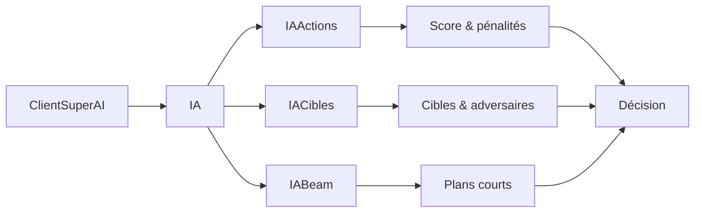

# IA et stratégie

Cette page décrit le fonctionnement interne du client **superAI**.

## But

À chaque tour, l'IA doit choisir une action qui maximise le score final
tout en minimisant le nombre de tours.

## Vue d'ensemble (schéma)


## Pipeline de décision détaillé

1. **Lecture** de l'état complet du labyrinthe.
2. **Distances** : BFS classique + BFS prenant en compte les bonus.
3. **Évaluation** de toutes les actions possibles.
4. **Choix d'une cible** (moule ou bonus).
5. **Exécution** de l'action.

## Pseudo‑code détaillé

```text
boucle jeu:
  message = lire()
  si message == "FIN": stop

  etat = parse(message)
  joueur = etat.joueur[id]

  distAdversaires = min_bfs_adversaires(etat)
  distBonus = bfs_avec_bonus(joueur)

  cible = choisir_cible(etat, distAdversaires, distBonus)

  meilleure = null
  meilleurScore = -inf

  pour chaque action possible:
    sim = simuler(action)
    score = score_action(sim, distAdversaires)
    score -= penalites(action, memoire)
    score += coeffProfondeur * meilleur_suivant(sim)

    si score > meilleurScore:
      meilleurScore = score
      meilleure = action

  envoyer(meilleure)
  mise_a_jour_memoire(sim)
```

## Exemple (Java, code highlight)

```java
DecisionIA decision = IA.choisirAction(
    etat,
    idJoueur,
    inventaire,
    parametres,
    dernierMouvement,
    memoire,
    memoireCible,
    toursSansPoints
);
```

## Évaluation d'une action

Pour une action candidate :

```
score = points_gagnés
      + valeurSaut * bonusSaut_gagné
      + valeurTroisPas * bonusTroisPas_gagné
      - penaliteUtilisationSaut * bonusSaut_utilisé
      - penaliteUtilisationTroisPas * bonusTroisPas_utilisé
      + futur
```

Le terme **futur** est une estimation rapide : il regarde les meilleurs objectifs
proches (moules/bonus) en fonction de la distance et de la concurrence.

## Distances bonus‑aware

L'IA utilise un BFS multi‑états :

- État = (case, nbSaut, nbTroisPas)
- Les transitions intègrent les bonus disponibles.
- On obtient une distance "min tours" plus réaliste.

### Pourquoi c'est important

Sans ce BFS multi‑états, l'IA surestime certaines distances et gaspille des bonus.
Avec la version bonus‑aware, l'IA sait **quand** un bonus réduit réellement le nombre de tours.

## Cibles et verrouillage

L'IA choisit une cible principale :

- on calcule un score de cible (valeur / distance / concurrence),
- on **verrouille** la cible quelques tours pour éviter les zigzags,
- si la cible devient trop mauvaise, on change.

## Mémoire et pénalités

Pour éviter les boucles :

- pénalité pour les demi‑tours,
- pénalité pour les cycles courts,
- pénalité pour rester immobile.

Ces pénalités évitent les oscillations (ex: N/S/N/S) et les blocages.

## Plan local (top‑K)

Quand `modePlan=1` :

- on garde un top‑K de cibles,
- on simule de courtes séquences,
- on choisit la première cible qui maximise le score total.

Cela stabilise les parcours et réduit les aller‑retour.

Par défaut : `nbCiblesPlan=8` et `profondeurPlan=4`.

## Mode hybride (score vs vitesse)

Si l'IA stagne ou si les moules restantes sont rares :

- elle privilégie la distance (mode accélération),
- elle utilise les bonus si le gain en tours est suffisant.

Le seuil est réglé par `gainDistanceBonusMin` et `gainDistanceBonusMinAccel`.

## Gestion des bonus côté client

- **Saut (Bs)** : le bonus n'est consommé que si la case à +2 est valide.
  Sinon, l'IA joue un pas simple si possible.
- **Trois pas (Bp)** : chaque pas est tenté dans l'ordre, les invalides sont ignorés.

## Modèle adversaire

- On estime la cible probable de chaque adversaire (meilleure valeur / distance).
- Si une case est probable pour eux et qu'ils sont plus proches, on pénalise le choix.
- Paramètre clé : `penaliteCibleAdverse`.
- Désactivé par défaut (mettre un poids > 0 pour l’activer).

## Carte de valeur (champ de potentiel)

- On ajoute un score global basé sur toutes les cases utiles.
- Ça aide à éviter les zigzags trop longs et oriente vers les zones denses.
- Paramètre clé : `coeffCarteValeur`.
- Désactivé par défaut (mettre un poids > 0 pour l’activer).

## Gestion bonus avancée

- Les bonus ne sont pris que si le gain en tours est réel.
- Si le gain est fort, l'IA reçoit un petit bonus de score.
- Paramètre clé : `bonusUsageEfficace`.
- Désactivé par défaut (mettre un poids > 0 pour l’activer).

## Preset par défaut

Le preset par défaut correspond à **G1B0** (rapide, stable sur beaucoup de seeds).
Tu peux surcharger tous les paramètres en ligne de commande.

## Organisation du code IA

- **IA.java** : orchestration générale (pipeline de décision).
- **IAActions.java** : génération d’actions + scoring + pénalités.
- **IACibles.java** : choix de cibles + adversaires + concurrence.
- **IABeam.java** : recherche par faisceau (optionnelle).

## Optimisations (perf, sans impact logique)

- **Cache BFS intra‑tour** : si plusieurs actions mènent à la même case, le BFS est réutilisé.
- **Liste compacte des cases utiles** (moules/bonus) pour l’estimation du futur.

Objectif : mêmes décisions, moins de calcul.



## Mode beam auto

`modeBeam=2` active un faisceau **seulement** si le laby paraît complexe :
- beaucoup de murs,
- beaucoup de moules restantes,
- grande grille.

Ça évite le coût du beam dans les cas simples.

## Limites connues

- Les décisions sont locales (pas de recherche profonde globale).
- L'IA peut manquer une moule lointaine très rentable si le chemin est trop long.
- Les paramètres ont un impact fort : tester par seeds est important.

## Exemple d'override

```bash
java -cp IA superAI.ClientSuperAI 127.0.0.1 1337 MonEquipe \
  modePlan=1 nbCiblesPlan=8 profondeurPlan=4 \
  penaliteDistance=1.6 coeffProfondeur=0.7
```
