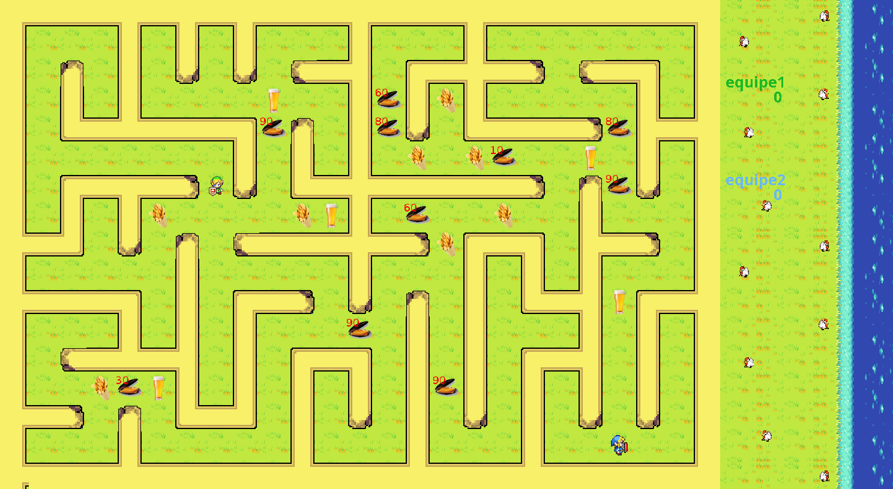
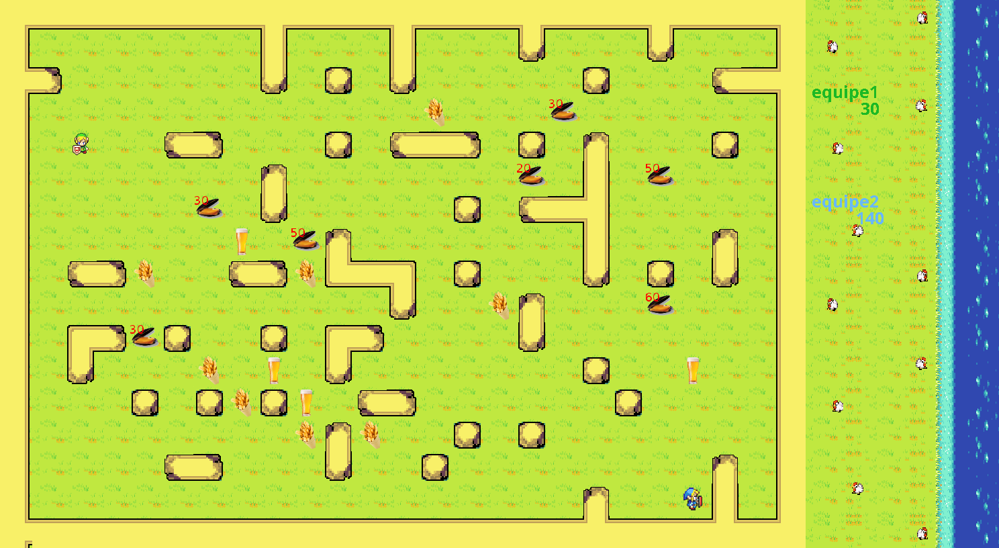

# AI Pêche aux Moules

Documentation utilisateur + technique du projet.

Cette doc sert à :

- comprendre les règles et le but du jeu,
- lancer un serveur et un client IA,
- régler les paramètres et comparer les presets,
- voir la structure du code IA,
- débugger rapidement en cas de souci.

> Si tu veux juste jouer : **Guide joueur** puis **Lancer une partie**.

---

## Accès rapide

<div class="cards">
  <div class="card">
    <h3>Jouer</h3>
    <p>Les règles, les bonus et le déroulement d'une partie.</p>
    <a href="guide_joueur/">Guide joueur</a>
  </div>
  <div class="card">
    <h3>Démarrer</h3>
    <p>Installer, compiler et lancer le serveur + l'IA.</p>
    <a href="lancer_partie/">Lancer une partie</a>
  </div>
  <div class="card">
    <h3>Paramétrer l'IA</h3>
    <p>Comprendre toutes les options de configuration.</p>
    <a href="parametres/">Paramètres CLI</a>
  </div>
  <div class="card">
    <h3>Code IA</h3>
    <p>Structure et organisation du client IA.</p>
    <a href="structure/">Structure du projet</a>
  </div>
  <div class="card">
    <h3>Tester</h3>
    <p>Comparer des presets sur des seeds fixes.</p>
    <a href="tests/">Tests & benchmarks</a>
  </div>
  <div class="card">
    <h3>Déboguer</h3>
    <p>Lire les logs et trouver rapidement les erreurs.</p>
    <a href="logs/">Logs & debug</a>
  </div>
  <div class="card">
    <h3>Urgence</h3>
    <p>Solutions rapides aux bugs classiques.</p>
    <a href="depannage/">Dépannage</a>
  </div>
</div>

## Résumé express

- **Jeu** : un labyrinthe, des moules (points) et des bonus.
- **But** : récupérer un maximum de points avant la fin.
- **IA** : un client qui choisit un coup à chaque tour.

## Architecture rapide

```
Serveur (Java)  <--- socket TCP --->  Client IA (superAI)
```

Le serveur envoie l'état complet du labyrinthe à chaque tour. Le client répond par un coup.

## Démarrage rapide (sans lecture)

Serveur :

```bash
cd Serveur
javac PecheAuxMoulesBoucle.java
java PecheAuxMoulesBoucle -nbJoueur 1 -delay 0 -timeout 3000
```

Client IA :

```bash
javac -d IA IA/superAI/*.java
java -cp IA superAI.ClientSuperAI 127.0.0.1 1337 MonEquipe
```

## Images du labyrinthe





---

Dernière mise à jour : 28/01/2026.
